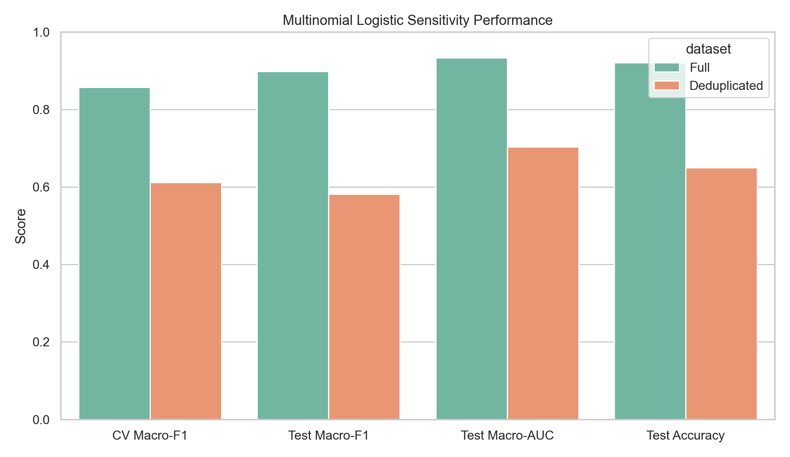

# Medical Bigdata Analysis

수면 건강 데이터셋을 기반으로 통계분석, 로지스틱 회귀, Ridge 로지스틱 회귀, 다항 로지스틱 회귀, 민감도 분석을 수행한 프로젝트입니다. `dataset`의 원천 데이터와 `reference`의 분석 참고 자료를 바탕으로, 수면장애와 관련된 핵심 변수와 활용 가능한 예측 모델을 정리했습니다.

## Featured Report

메인 보고서:

- [데이터셋 선택 근거, 다항 로지스틱 회귀, 민감도 분석 보고서](results/multinomial_sensitivity_study/multinomial_sensitivity_report_ko.md)

추가 보고서:

- [Ridge 로지스틱 회귀 및 파생변수 탐색 보고서](results/ridge_feature_study/ridge_feature_study_report_ko.md)
- [수면장애 통계분석 한국어 요약](results/sleep_disorder_statistical_summary_ko.md)
- [수면장애 통계분석 상세 보고서](results/sleep_disorder_statistical_report.md)

## Project Structure

- `analysis/`: 재현 가능한 분석 스크립트
- `dataset/`: 원천 데이터셋
- `reference/`: 분석 방법 참고 자료
- `results/`: 보고서, 표, 시각화 결과물

## Key Findings

- 수면장애와 가장 밀접한 축은 혈압, 수면의 질, 나이, 심박수, 수면 부족량이었다.
- Ridge 기반 압축형 모델에서는 `Mean Arterial Pressure`, `Pulse Pressure`, `Sleep Deficit`, `Sleep-Stress Balance` 같은 파생변수가 공선성 완화에 유효했다.
- 다항 로지스틱 회귀에서는 `Insomnia`와 `Sleep Apnea`가 서로 다른 위험 패턴을 보였다.
- 중복 프로파일 제거 민감도 분석 결과, 변수 방향성은 유지됐지만 모델 성능은 하락해 원본 데이터의 반복 구조가 예측 성능을 다소 낙관적으로 만들었음을 확인했다.

## Reproducible Analyses

- `analysis/sleep_disorder_statistical_analysis.py`
- `analysis/ridge_logistic_feature_engineering_analysis.py`
- `analysis/multinomial_sensitivity_analysis.py`

## Visual Outputs

대표 시각화는 아래 경로에 정리되어 있습니다.

- `results/figures/`
- `results/ridge_feature_study/figures/`
- `results/multinomial_sensitivity_study/figures/`
