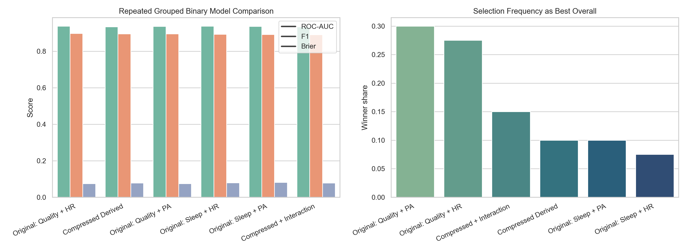

# Medical Bigdata Analysis

수면 건강 데이터셋을 기반으로 통계분석, 로지스틱 회귀, Ridge 로지스틱 회귀, 다항 로지스틱 회귀, 민감도 분석, 그리고 repeated grouped validation, calibration, profile-cluster GEE sensitivity analysis까지 포함한 후속 검증을 수행한 프로젝트입니다. `dataset`의 원천 데이터와 `reference`의 분석 참고 자료를 바탕으로, 수면장애와 관련된 핵심 변수와 실제로 추천할 만한 예측 모델을 다시 정리했습니다.

## Featured Report

메인 보고서:

- [수면장애 통합 메인 보고서](results/sleep_disorder_statistical_summary_ko.md)

추가 보고서:

- [분석 흐름과 실험 당위성 정리](results/final_synthesis/analysis_sequence_and_rationale_ko.md)
- [인사이트 및 활용 요약](results/final_synthesis/insights_and_applications_ko.md)
- [비판 포인트 해소를 위한 추가 검증 보고서](results/critical_resolution/critical_resolution_report_ko.md)
- [후속 엄밀성 검증 보고서](results/rigorous_validation/rigorous_validation_report_ko.md)
- [Ridge 로지스틱 회귀 및 파생변수 탐색 보고서](results/ridge_feature_study/ridge_feature_study_report_ko.md)
- [데이터셋 선택 근거, 다항 로지스틱 회귀, 민감도 분석 보고서](results/multinomial_sensitivity_study/multinomial_sensitivity_report_ko.md)
- [수면장애 통계분석 상세 보고서](results/sleep_disorder_statistical_report.md)

## Project Structure

- `analysis/`: 재현 가능한 분석 스크립트
- `dataset/`: 원천 데이터셋
- `reference/`: 분석 방법 참고 자료
- `results/`: 보고서, 표, 시각화 결과물

## Key Findings

- Welch/Kruskal/FDR를 거친 후에도 혈압, 나이, 수면시간, 활동량, 수면의 질 축은 강건하게 유지됐다.
- repeated grouped `neg_log_loss` 기준 예측 우선 모델은 `Age + Quality of Sleep + Physical Activity Level + Diastolic BP + male + bmi_risk` 였고, `Sleep + PA` 조합은 self-reported quality를 덜 쓰는 보수적 baseline으로 매우 근접한 성능을 유지했다.
- 가장 안정적으로 남는 변수는 여전히 `Diastolic BP`이며, profile-cluster GEE sensitivity analysis에서도 OR `1.302 (95% CI 1.077–1.575)` 으로 유지됐다.
- quality 기반 상위 모델에서는 `Quality of Sleep`도 유의한 보호 방향 신호로 반복 확인됐다.
- threshold 안정성은 추가 calibration보다 `neg_log_loss` 기반 튜닝에서 더 직접적으로 개선됐고, grouped multinomial validation에서도 `macro-F1 0.849`, `macro-AUC 0.911`로 subtype 구조가 유지됐다.

## Current Caveats

- `Occupation`은 강한 차이를 보였지만 희소 셀 문제 때문에 최종 모델에서는 제외했다.
- grouped CV로 직접 누수는 줄였지만, 반복 profile 구조 때문에 표본 정보량은 여전히 보수적으로 해석하는 것이 맞다.
- predictor profile 기준으로도 서로 다른 라벨이 붙는 ambiguous case가 적지 않아, 모델은 결정 규칙보다 확률 모델로 이해하는 편이 정확하다.
- 상위 모델 간 차이는 작아서, `prediction-first` 추천과 `해석/측정 보수성` 기준 추천이 다를 수 있다.
- repeated grouped 기준 threshold 평균은 0.50 부근이지만 표준편차가 약 0.15여서, 운영 cutoff는 여전히 별도 검증이 더 바람직하다.
- 메인 추천 모델은 `수면장애 유무` 이진 타깃 기준이며, subtype 차이는 `multinomial_sensitivity_report_ko.md`와 `critical_resolution_report_ko.md`를 함께 봐야 정확하다.

## Reproducible Analyses

- `analysis/sleep_disorder_statistical_analysis.py`
- `analysis/ridge_logistic_feature_engineering_analysis.py`
- `analysis/multinomial_sensitivity_analysis.py`
- `analysis/rigorous_followup_validation.py`
- `analysis/critical_resolution_experiments.py`

## Visual Outputs

대표 시각화는 아래 경로에 정리되어 있습니다.

- `results/figures/`
- `results/ridge_feature_study/figures/`
- `results/multinomial_sensitivity_study/figures/`
- `results/rigorous_validation/figures/`
- `results/critical_resolution/figures/`
